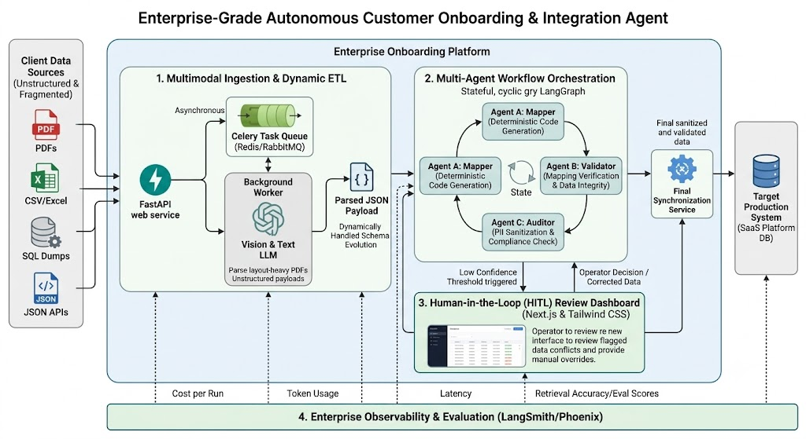

# Enterprise Autonomous Customer Onboarding & Integration Platform

Enterprise-grade autonomous customer onboarding platform that transforms unstructured client data (PDFs, SQL dumps, CSVs, JSON APIs) into validated, production-ready records using multimodal AI, multi-agent orchestration, human-in-the-loop review, and full observability

 

### Why this project exists 
Enterprise onboarding often takes **days or weeks** because customer data arrives in inconsistent formats, schemas evolve constantly, and validation rules are embedded in human workflows. This project demonstrates how I would design and operate a **production-ready AI integration platform** as a **Forward Deployed Engineer (FDE)**: - Understand ambiguous client data - Build adaptive ingestion pipelines - Orchestrate AI + deterministic validation - Keep humans in control - Deploy, monitor, and evaluate the system end-to-end
---

## FDE Lens 
This repository is intentionally built to demonstrate the skills expected from a Forward Deployed / Applied AI Engineer. 
| Capability | Demonstrated |
|---|---|
| Client problem framing | Messy enterprise onboarding |
| Systems architecture | Multi-service platform |
| AI engineering | Vision + text extraction |
| Workflow orchestration | LangGraph / Temporal |
| Backend engineering | FastAPI + Celery |
| Frontend product thinking | React.js/Next.js dashboard |
| DevOps | Docker, CI/CD, observability |
| Reliability | Retries, idempotency, DLQ |
| Governance | PII sanitization & audit trail |
| Evaluation | LangSmith / Phoenix metrics | **The goal is not a demo. The goal is an operable enterprise system.**
---

## Business Outcomes 
- Reduce onboarding turnaround from **days to minutes** 
- Handle **schema evolution without code rewrites** 
- Detect **PII and compliance risks automatically** 
- Route low-confidence cases to human operators 
- Produce **auditable synchronization logs** 
- Measure extraction quality, latency, and token cost
--- 

## Architecture
### 1. Multimodal Ingestion
- PDFs
- CSV/Excel
- SQL dumps
- JSON APIs

### 2. Dynamic ETL
- Vision LLM for layout-heavy documents
- Structured parsers for machine-readable sources
- Canonical schema normalization
- Schema version tracking

### 3. Multi-Agent Orchestration
- Mapper agent
- Validator agent
- Auditor agent

### 4. Human-in-the-Loop
- Confidence thresholds
- Conflict resolution
- Manual overrides
- Audit history

### 5. Production Synchronization
- Idempotent writes
- Retry policies
- Dead-letter queue
- Change tracking

### 6. Observability
- Traces
- Evaluation datasets
- Token analytics
- Latency metrics
- Failure analysis

